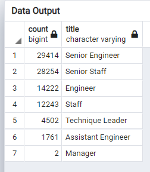
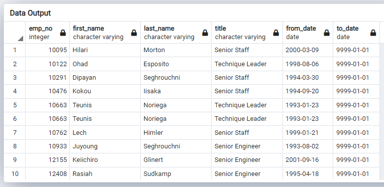
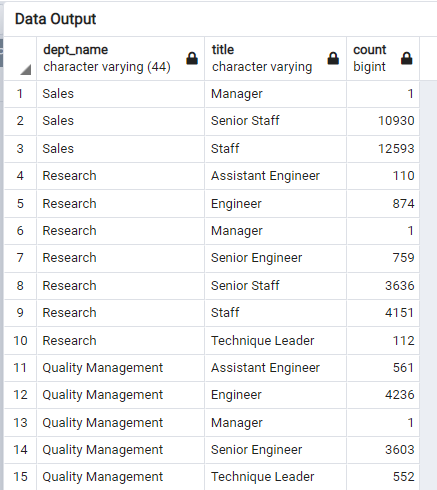
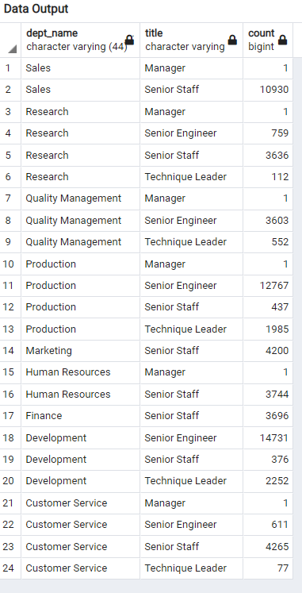

# Pewlett Hackard Analysis
## Overview of the Analysis 

The purpose of the analysis is to combine and examine multiple datasets on Pewlett Hackard employees. Using postgresSQL and pgAdmin, we will clean data, collect information, and conduct two analyses. 

In the first part of the analysis, we will create a table of the titles of all employees who were born Janurary 1st, 1952 to December 31st, 1955. This table is called Retirement Titles and can be found in the Data folder as a csv file. 

In the second part of the analysis, we will create a table of employees, born between January 1st, 1965 and December 31st, 1965, that are eligibile to become mentors. This table is called Mentorship Eligibility and can be found in the Data folder as a csv file. 

- Resources:
  - pgAdmin, postgresSQL
  - The following csv files: 
    - departments.csv
    - dept_emp.csv
    - dept_manager.csv
    - employees.csv
    - salaries.csv
    - titles.csv
    - unique_titles.csv
    - unique_titles_dept.csv

## Results
- Retiring Employees:
  - The image below shows the number of employees retiring by job title. There are a total of 90398 employees retiring.
  - Over half of the employees that are retiring are Senior Engineers and Senior Staff. 
  - This means that a huge amount of leadership roles will need to be filled. 

- Mentorship Eligibility:
  - The image below shows the first ten employees who are eligible to be mentors. There are a total of 1708 employees eligible for the mentorship program. 
  - There are not enough employees to mentor people for the upcoming "silver tsunami" retirement wave.
  - Pewlett Hackard should consider expanding the eligibility criteria to those who are retiring, as well as those who have been in their position for over five years (or another measure for determining eligibility).
   

## Summary
Provide high-level responses to the following questions, then provide two additional queries or tables that may provide more insight into the upcoming "silver tsunami."

- How many roles will need to be filled as the "silver tsunami" begins to make an impact?
  - The image below is from rolls_to_fill.csv. It shows the first 30 rows out of 42. It shows the count of each title by department that needs to be filled. 
  - There are a total of 147,942 roles to be filled. 
  - By department, the number of roles are:
    - Sales - 23,524
    - Research - 9,643
    - Quality Management - 8,953
    - Production - 32,574
    - Marketing - 9,040
    - Human Resources - 8,156
    - Finance - 7,885
    - Development - 37,508
    - Customer Service - 10, 659
  - From this list we can see that a majority of the roles to be filled are in Sales and Production. 

- Are there enough qualified, retirement-ready employees in the departments to mentor the next generation of Pewlett Hackard employees?
  - There are 68,739 qualified employees total. To figure this out, a table was created using the information from unique_titles.csv where only leadership roles were considered. 
    - These roles are Senior Engineer, Senior Staff, Manager, and Technique Leader
  - In the image below you can see the number of employees who fit the criteria in each role by department. 
  - By department, the number of qualified employees are:
    - Sales - 10,931
    - Research - 4,508
    - Quality Management - 4,156
    - Production - 15,190
    - Marketing - 4,200
    - Human Resources - 3,745
    - Finance - 3696
    - Development - 17,359
    - Customer Service - 4,954
  - Based on these numbers, some departments have a 1:2 ratio; one mentor per two trainees. Other departments will have one mentor per three or four trainees. This should be plenty of mentors. They should be able to train new employees in a one on one setting, unless Pewlett Hackard hires all of these new employees at once. 
  - Pewlett Hackard should consider the criteria for promoting current employees to fill the upcoming roles, as their training time would be cut down thanks to their current employee status. 
  
 

